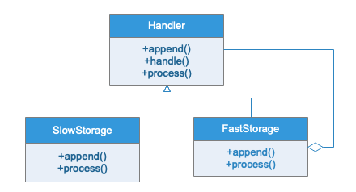

# 职责链模式

## 模式定义

职责链模式可以使多个对象都有机会处理请求，从而避免请求的发送者和接受者之间的耦合关系。将对象连成一条链，并沿着这条链传递该请求，直到一个对象处理他为止。

## 职责链优点

当客户提交一个请求时，请求是沿链传递直至有一个ConcreteHandler对象负责处理它。这就使得接受者和发送者之都没有对方的明确信息，且链中的对象自己也并不知道链的结构。结果是职责链可简化对象的相互连接，他们仅仅需要保持一个指向其后继者的引用，而不需要保持它所有时候选接受者的引用。也就是说可以随时增加和修改处理一个请求的结构增强了给对象指判职责的灵活性。不过需要注意的是，一个请求极有可能到了链的末端都得不到处理，或者因为没有正确配置而得不到处理。

## 应用场景

责任链模式的主要优点在于可以降低系统的耦合度，简化对象的相互连接，同时增强给对象指派职责的灵活性，增加新的请求处理类也很方便；其主要缺点在于不能保证请求一定被接收，且对于比较长的职责链，请求的处理可能涉及到多个处理对象，系统性能将受到一定影响，而且在进行代码调试时不太方便。
责任链模式在现实中使用的很多，常见的就是 OA 系统中的工作流。

## UML 类图

## 实例类图

