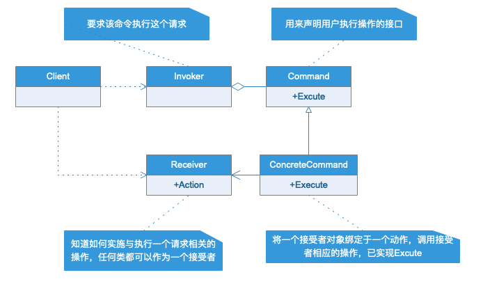

# 命令模式

## 模式定义

将一个请求封装为一个对象，从而使你可以不用不同的请求对客户参数进行参数化；对请求排队或记录请求日志，以及支持可撤销的的操作。

## 模式作用

- 可以用于设计命令队列
- 在需要的情况下可以容易的将命令记入日志
- 允许接受请求的一方决定是否要否决请求
- 可以容易的实现请求撤销和重做
- 由于新进的具体命令类不影响其他的类，因此新增具体类很容易
- 命令模式可以把请求一个操作对象与知道怎么执行一个操作对象分开

## 注意事项

敏捷开发原则告诉我们，不要为代码添加基于猜测的、实际不需要的的功能。如果不清楚这一系统是否需要命令模式，一般不需要着急去实现它，事实上，在需要的时候通过重构实现这个模式并不困难，只有在真正需要如撤销/恢复操作时，把原来的代码重构为命令模式才有意义。

## UML类图

## 实例类图

