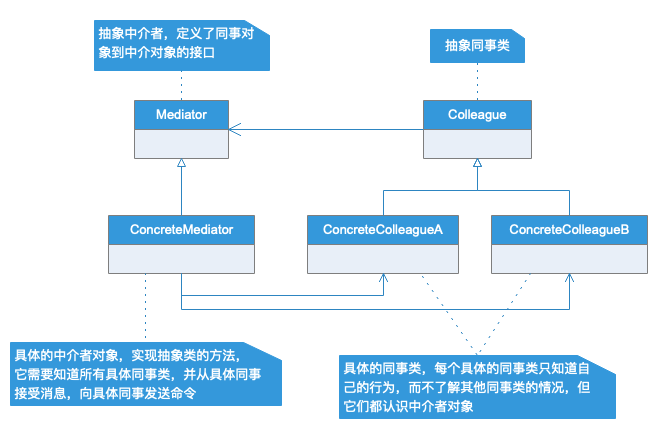
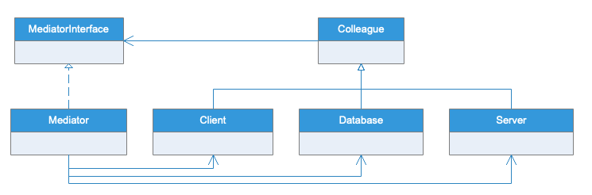

# 中介模式

## 模式定义

用一个中介对象来封装一些列的对象交互。中介者使得各对象不需要显示地相互引用，从而使其耦合松散，而且可以独立的改变他们之间的交互。

## 模式优缺点

中介模式可以很容易的在系统中应用，也很容易误用。当系统中出现了多对多交互复杂的对象群时，不要急于使用中介者模式，而要反思系统设计的是否合理，
中介者模式可以减少各个交互对象之间的耦合，使得其可以独立变化。由于对象如何协作进行了抽象，将中介作为一个独立的概念并将其封装在一个对象中，这样关注的对象就从对象各自本身的行为转移到它们之间的交互上来，也就是站在一个更宏观的角度去观察系统。
但是，由于中介者控制了集中化，于是就把交互的复杂性变为了中介者的复杂性，这就使得中介者比任何一个参与交互的类本身都复杂而变得难以维护。

## 应用场景

中介者模式一般应用于一组对象已定义良好，但是已以复杂的方式进行交互的场景，以及想定制一个分布于多个类中的行为而又不想生成太多子类的场合。

## UML类图

## 实例类图

