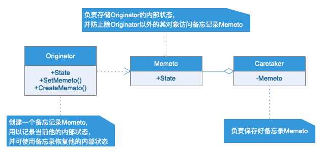
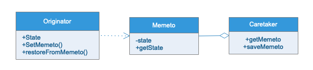

# 备忘录模式

## 模式定义

在不破坏封装的前提下，捕获一个对象的内部状态，并在外部保存这个状态。这样这个对象以后可以恢复到原先保存的状态。

## 应用场景

- Memento模式比较适用的功能比较复杂，但需要维护或记录历史的类，或者需要保存的属性只是众多属性中的一小部分时，Originator可以根据保存的Memeto信息还原到这一状态。
- 如果在某个系统中使用命令模式时，需要实现命令的撤销操作，那么命令模式可以使用备忘录模式来记录命令执行前的状态。
- 使用备忘录模式可以把复杂对象的内部信息对其他的对象屏蔽起来。
- 当角色的状态发生改变的时候，有可能这个状态是无效的，这时候就可以使用暂时存储起来的备忘录将角色的状态还原。

## UML类图

## 实例类图

