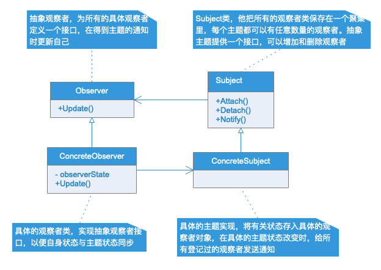

# 观察者模式

## 模式定义

观察者模式定义了一种多对多的依赖关系，让多个观察者对象同事监听一个主题对象，这个主题对象在状态发生变化时，会通知所有观察者对象，让他们能够自动更新自己。

## 应用场景

- 将一个系统分割成一系列相互协作的类有一个很不好的副作用，那就是需要维护相互对象的一致性，我们不希望为了维护一致性而使得各个类之间紧密耦合，这样给维护、扩展或者重用都带了不便。这个时候可以使用观察者模式来实现解耦。
- 当一个对象改变需要同时改变其他对象，而且他不知道具体有多少对象待改变时，应该考虑使用观察者模式。

观察者模式所做的工作其实就是在解耦。让耦合的双方都依赖于抽象，而不是依赖于具体。从而使得各自的变化都不会影响到另一边的变化。

## 关于 PHP

PHP 为观察者模式定义了两个接口：SplSubject 和 SplObserver。SplSubject 可以看做主体对象的抽象，SplObserver 可以看做观察者对象的抽象，要实现观察者模式，只需让主体对象实现
SplSubject，观察者对象实现 SplObserver，并实现相应方法即可。

## UML 类图

