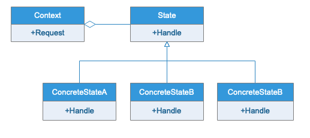
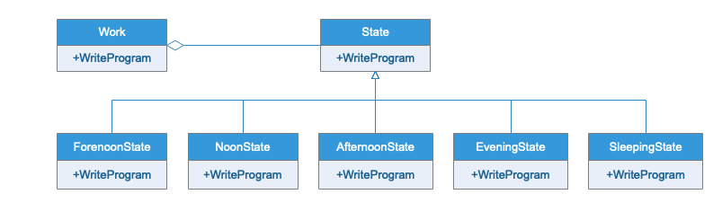

# 状态模式

## 模式定义

当一个对象的状态改变时允许其行为改变，这个对象看起来就像是改变了其类。

## 应用场景

状态模式主要解决的是当控制一个对象的状态转换的条件表达式过于复杂的情况。把状态判断逻辑转移到表示不同状态的一系列类当中，可以把复杂的判断简化。
状态模式的主要优点在于封装了转换规则，并枚举可能的状态，它将所有与某个状态有关的行为放到一个类中，并且可以方便地增加新的状态，只需要改变对象状态即可改变对象的行为，还可以让多个环境对象共享一个状态对象，从而减少系统中对象的个数；其缺点在于使用状态模式会增加系统类和对象的个数，且状态模式的结构与实现都较为复杂，如果使用不当将导致程序结构和代码的混乱，对于可以切换状态的状态模式不满足“开闭原则”的要求。

## 模式优点

状态模式将于特定状态相关的行为局部化，并将不同状态的行为分割开来。将特定状态的行为封装一个类中，这样动过定义新的状态子类就可以很容易的增加新的状态和转换。

## UML类图

## 实例类图

