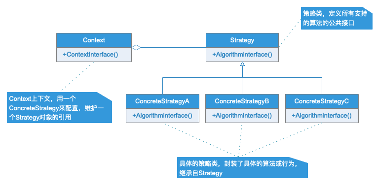
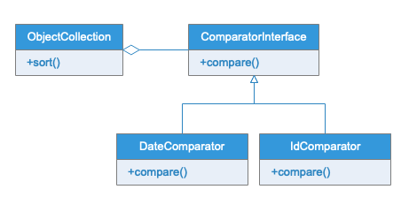

# 策略模式

## 模式定义

策略模式定义了算法家族，分别封装起来，让他们之间可以相互替换，此模式算法的变化，不会影响到使用算法的客户。

## 适用场景

- 通常，策略模式适用于当一个应用程序需要实现一种特定的服务或者功能，而且该程序有多种实现方式时使用。常见的使用场景比如对象筛选，可以根据日期筛选，也可以根据 ID 筛选；又比如在单元测试中，我们可以在文件和内存存储之间进行切换。
- 策略模式就是用来封装算法的，但在实践中，我们发现可以用它来封装几乎任何类型的规则，只要在分析过程中听到需要在不同的情况下适用不用业务规则就可以考虑适用策略模式处理这种变化的可能性。

## UML类图

## 实例类图

