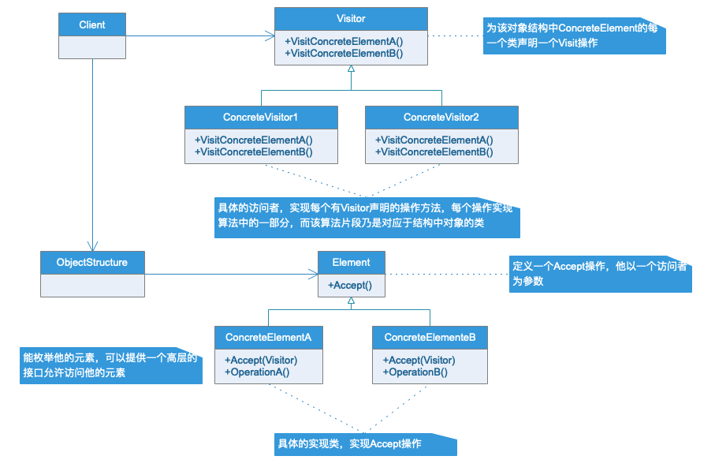
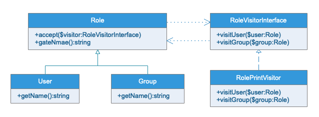

# 访问者模式

## 模式定义

表示一个作用于某对象结构中各元素的操作。它使你可以在不改变各元素的类的前提下定义作用于这些元素的新操作。

## 访问者模式的作用

- 访问者模式适用于数据结构相对稳定的系统。该模式把数据结构和作用于结构上的操作之间的耦合解脱开，是的操作集合可以相对自由的演化。
- 访问者模式的目的是要把处理从数据结构分离出来。如果系统有比较稳定的数据结构，又有易于变化的算法的话，使用访问者模式比较合适，因为访问者模式使得算法的操作变得更加容易。但是访问者模式会让添加新的数据结构变得十分麻烦

## UML类图

## 实例类图

