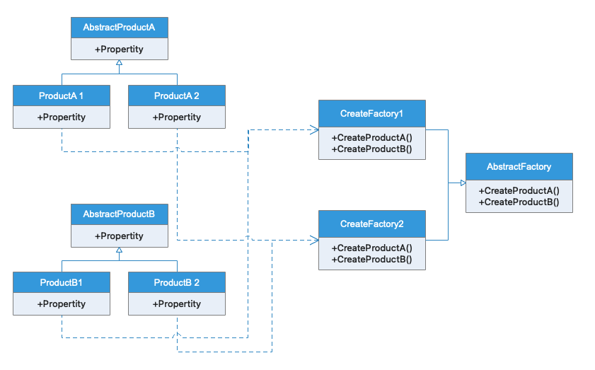
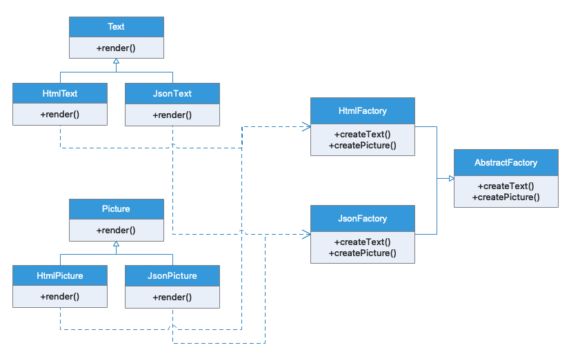

# 抽象工厂

## 模式定义

抽象工厂模式为一组相关或相互依赖的对象创建提供接口，而无需指定其具体实现类。抽象工厂的客户端不关心如何创建这些对象，只关心如何将它们组合到一起。

## 应用场景

例如，如果某个应用是可移植的，那么它需要封装平台依赖，这些平台可能包括窗口系统、操作系统、数据库等等。这种封装如果未经设计，通常代码会包含多个 if 条件语句以及对应平台的操作。这种硬编码不仅可读性差，而且扩展性也不好。

## 与工厂模式区别

工厂模式生产产品，抽象工厂生产产品族。抽象工厂可以添加产品族，不能添加产品

## UML类图

## 实例类图

