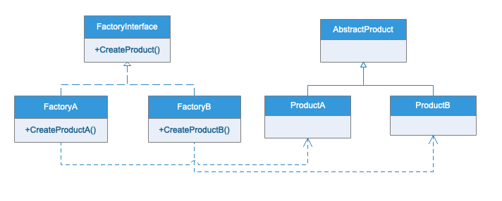
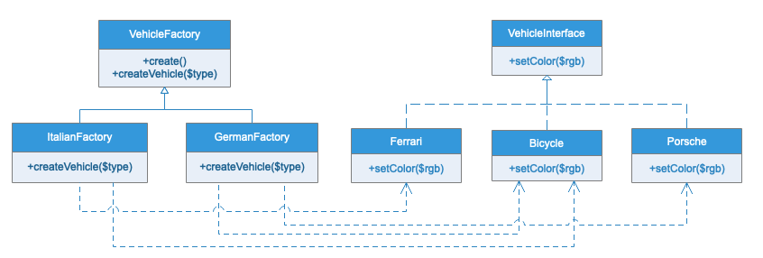

# 工厂模式

## 模式定义

定义一个创建对象的接口，但是让子类去实例化具体类。工厂方法模式让类的实例化延迟到子类中。

## 与简单工厂的区别

- 简单工厂最大的有点在于工厂类中包含了必要的逻辑判断，根据客户端的选择条件动态实例化相关的类，对于客户端来说，去除了类与产品的依赖。
- 但是如果要增加需要实例化的类型，就需要修改工厂的创建实例的方法，这样就不但对扩展开发，同时也对修改开放，不符合开闭原则

## 与抽象工厂的区别

工厂方法模式和抽象工厂模式有点类似，但也有不同。 工厂方法针对每一种产品提供一个工厂类，通过不同的工厂实例来创建不同的产品实例，在同一等级结构中，支持增加任意产品。
抽象工厂是应对产品族概念的，比如说，每个汽车公司可能要同时生产轿车，货车，客车，那么每一个工厂都要有创建轿车，货车和客车的方法。应对产品族概念而生，增加新的产品线很容易，但是无法增加新的产品。

## UML类图

## 实例类图

