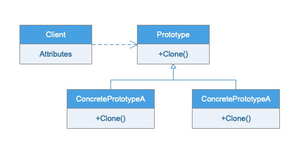
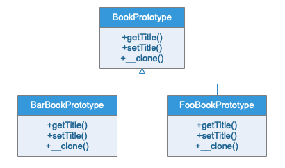

# 原型模型

## 模型定义

用原型实例指定创建对象的类型，并通过拷贝这些原型创建对象。

## 应用场景

原型模式的主要思想是基于现有的对象克隆一个新的对象出来，一般是用对象内部提供的克隆方法，通过该方法返回一个对象的副本，这种创建对象的方式，相比我们之前说的几类创建型模式还是有区别的，之前的讲述的工厂方法模式与抽象工厂都是通过工厂封装具体的
new 操作的过程，返回一个新的对象，有的时候我们通过这样的创建工厂创建对象不值得，特别是以下的几个场景，可能使用原型模式更简单、效率更高：

- 如果说我们的对象类型不是刚开始就能确定，而是在运行时确定的话，那么我们通过这个类型的对象克隆出一个新的类型更容易。
- 有的时候我们可能在实际的项目中需要一个对象在某个状态下的副本，这个前提很重要，这点怎么理解呢，例如有的时候我们需要对比一个对象经过处理后的状态和处理前的状态是否发生过改变，可能我们就需要在执行某段处理之前，克隆这个对象此时状态的副本，然后等执行后的状态进行相应的对比，这样的应用在项目中也是经常会出现的。
- 当我们处理的对象比较简单，并且对象之间的区别很小，可能只是很固定的几个属性不同的时候，使用原型模式更合适。

## UML类图

## 示例类图

