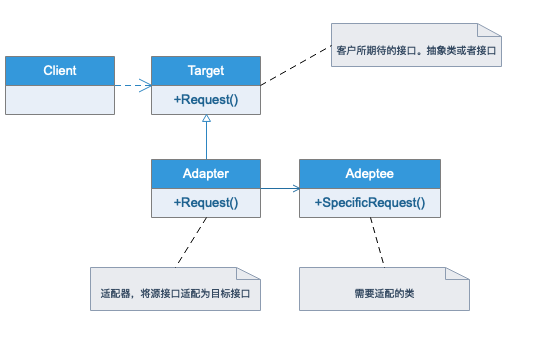
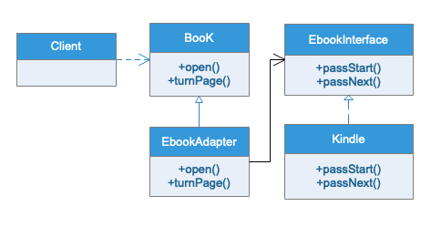

# 适配器模型

## 模式定义

将一个类的接口转换为客户希望的另外一个接口。Adapter模式使得原本由于接口不兼容而不能一起工作的类可以一起工作。

## 适用场景

系统的数据和行为都正确，但是接口不符时，我们应该考虑使用适配器，目的是使控制范围之外的的一个原有对象与接口匹配。适配器模式主要应用于希望复用的一些现存类或者三方的库，但是接口又与复用环境不一致的情况。

## UML类图

## 实例类图

