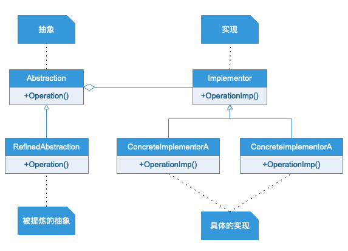

# 桥接模式
## 模式定义
将抽象与他的实现部分分离，使他们都可以独立的变化
## 适用场景
抽象与实现分离并不是说让抽象类和器派生类锋利，因为这没有任何意义。实现指的是抽象类和他的派生类用来实现自己的对象。比如手机可以可以按照品牌来分类，也可以按照功能来分类。由于实现的方式有多种，桥接模式的核心思想就是把这些实现独立出来让他们各自独立变化。这就使得每种实现的变化不会影响其他实现。

实现系统有多角度的分类，每一种分类都可能变化，可以将这种多角度的变化分离出去让他们独立变化，减少他们之间的耦合。

桥梁模式完全是为了解决继承的缺点而提出的设计模式。在该模式下，实现可以不受抽象的约束，不用再绑定在一个固定的抽象层次上。
## 注意事项
系统设计时，发现类的继承有 N 层时，可以考虑使用桥梁模式。使用桥梁模式时主要考虑如何拆分抽象和实现，并不是一涉及继承就要考虑使用该模式。桥梁模式的意图还是对变化的封装，尽量把可能变化的因素封装到最细、最小的逻辑单元中，避免风险扩散。
## UML类图

## 实例类图
