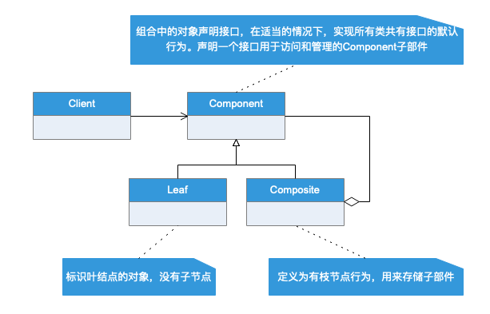
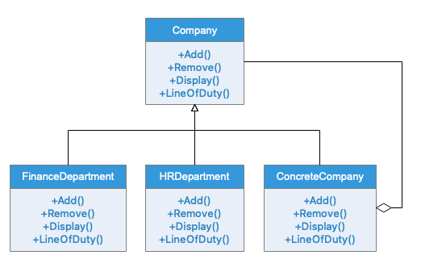

# 组合模式
## 模式定义
将对象组合成 树形结构以表示'部分-整体'的结构层次。组合模式使得用户对单个对象和组合对象的使用具有一致性。
## 应用场景
需求中是提现部分与整体的结构层次的结构时，以及你希望用户可以忽略组合对象与单个对象的不同，统一地使用组合结构中的所有对象时，就应该考虑组合模式了。常见的场景如如树形菜单、文件夹菜单、部门组织架构图等。
## UML类图

## 实例类图
