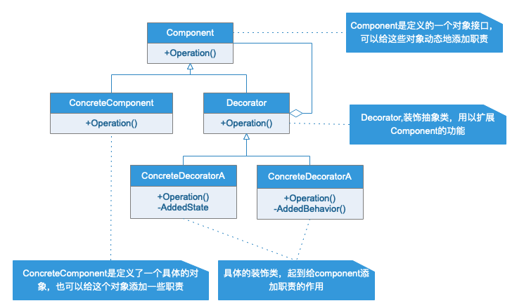
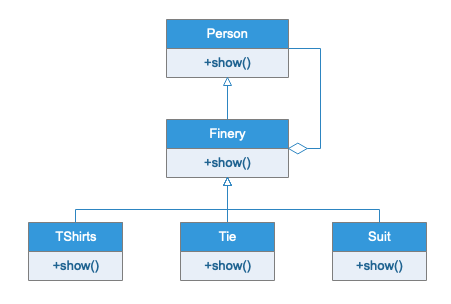

# 装饰模式

## 模式定义

动态的给一个对象添加一些额外的职责，就新加功能来说，装饰模式比生成子类更加灵活。

## 应用场景

当系统需要新功能的时候，是向旧的类中添加新的代码。这些新加的代码通常装饰了原有类的核心职责或主要行为。在主类中添加新的代字段、方法或者逻辑，从而增加了主类的复杂程度，而这些新加入的代码仅仅是为了满足一写只有在特定情况下才会执行的特殊行为的需要。装饰模式提供了一个解决方案，他把每个要装饰的功能封装在一个新的类中，并让这个类包装他需要的装饰的对象，因此，当执行需要特殊行为时，客户端就可以在运行的时候根据情况有选择地，按顺序地使用装饰功能包装对象。
有效的将类的核心职责与装饰功能区分开始是使用装饰模式的关键，只有这样才可以简化原有的类。

## UML 类图

Component是定义的一个对象接口，可以给这些对象动态地添加职责。ConcreteComponent是定义的一个具体的对象，也可以给这个对象添加一些职责。Decorator,装饰抽象类，继承Component，从外来类来扩展Component类的功能,但对弈Component来说是无需知道Decorator类存在的。至于ConcreteDecorator就是具体的装饰类，起到给Component类添加职责的作用

## 实例类图

