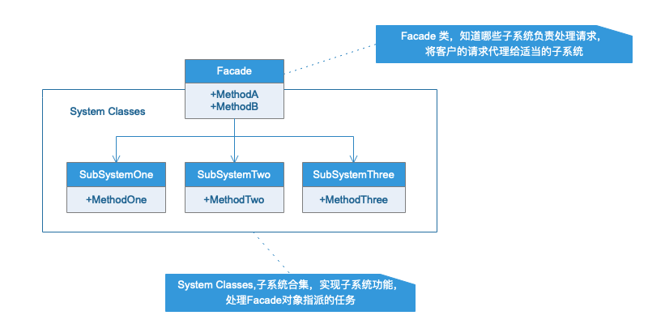
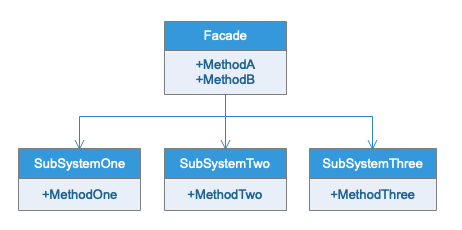

# 外观模式
## 模式定义
为子系统中的一组接口提供一个一致的界面，此模式定义了一个高层次的接口，这个接口使得这一子系统更加容易使用。
## 应用场景
首先，在设计的初期阶段，应该要有意识的将不同的两层分离，层与层之间建立外观facade,这样可以为复杂的子系统提供一个简单的接口，使耦合大大降低。
其次，在开发阶段子系统因为不断的重构和演化而变得越来越复杂，增加外观facade可以提供一个简单的接口，减少他们之间的依赖。
第三，在维护一个大型的系统时，可能这个系统已经非常难以维护和扩展了，但是新的系统又必须要依赖它，可以为新的系统开发一个Facade类，来提供设计粗糙或高度复杂的遗留代码的比较清晰简单的接口，让新系统与Facade对象交互，facade与遗留代码交互所有复杂的工作
## UML类图

## 实例类图
