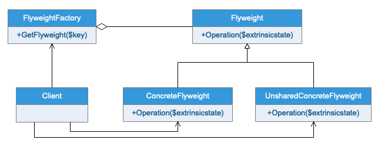
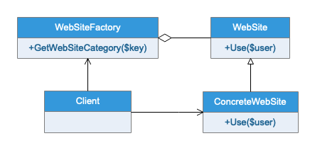

# 享元模式
## 模式定义
运用共享技术有效地支持大量细粒度的对象
## 应用场景
享元模式可以避免大量非常相似的开销。在程序设计中，有时需要生成大量的细粒度的类实例来表示数据。如果能发现这些实例除了几个参数外基本上是相同的，有时候就能够大幅度地减少需要实例化的类的数量。如果能把那些参数移到类的实例外面，在方法调用的时候把他们传递进来，就可以通过共享大幅度减少单个实例的数目。

如果一个应用程序使用了大量对象，而大量的这些对象造成了很大的的存储开销时可以考虑使用；还有就是对象的大多数状态都是外部状态，如果删除对象的外部状态那么可以使用相对较少的共享对象代替很多组对象，此时可以考虑使用享元模式。
## UML类图

## 实例类图
