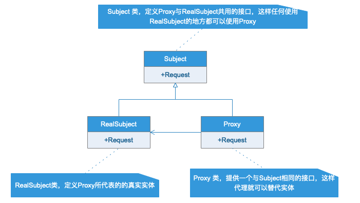
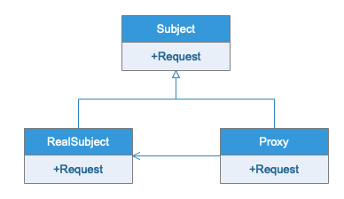

# 代理模式
## 模式定义
为其他对象提供一种代理以控制对这个对象的访问
## 应用场景
- 远程代理，也就是为一个对象在不同的地址空间提供局部代表。这样可以隐藏一个对象存在于不同地址空间的事实。
- 虚拟代理，是根据需要创建开销很大的对象。通过通过他来存放实例化需要很长时间的真实对象。
- 安全代理，用来控制真实对象的访问权限。
- 智能指引，当调用真实对象时，代理处理另外的一些事。如计算真实对象的引用次数，这样当对象没有引用时，可以自动释放他。或当第一次引用持久对象时将他装入内存。
## UML类图

## 实例类图
